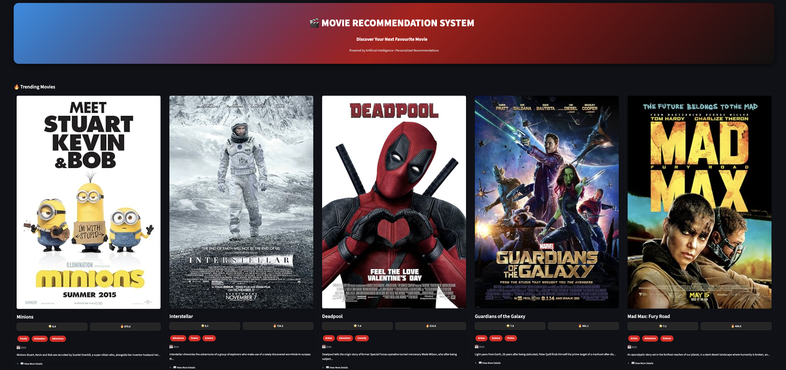
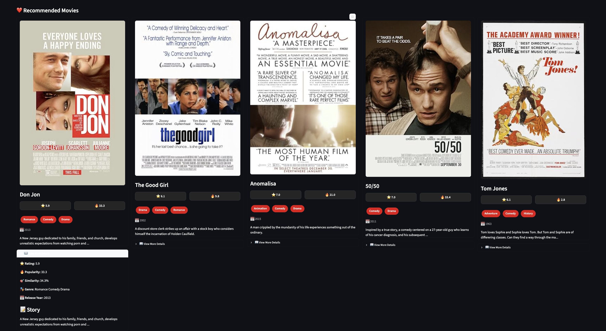
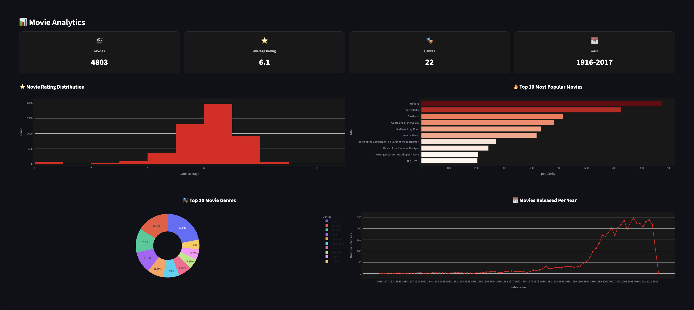
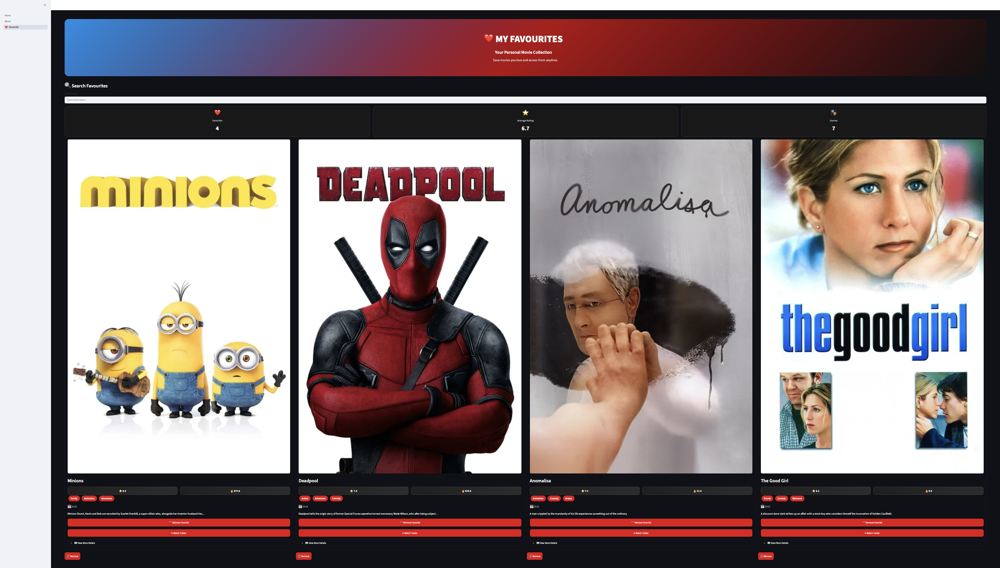
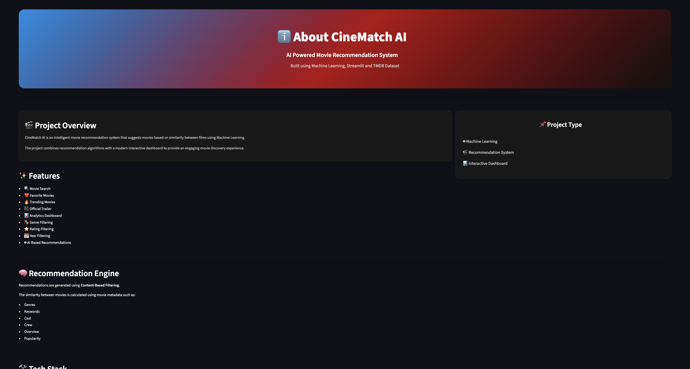

# 🎬 CineMatch AI – Movie Recommendation System

An AI-powered Movie Recommendation System built with **Python**, **Streamlit**, and **Machine Learning**.

CineMatch AI recommends movies based on content similarity and provides rich movie information including posters, trailers, analytics, favorites, and interactive dashboards.

---

             

---

## 🚀 Live Demo

🔗 Streamlit App: https://movierecommendationsystem-e64itaawmuufzdlh6dhvy4.streamlit.app/

---

## 🚀 Features

- 🔍 Search any movie instantly
- ❤️ Add & remove favorite movies
- 🎬 AI-powered movie recommendations
- 🎥 Watch official trailers
- 🖼 Movie posters
- 📊 Interactive analytics dashboard
- 🎭 Genre filtering
- ⭐ Rating filtering
- 📅 Release year filtering
- 🔥 Popularity filtering
- 📈 Plotly visualizations
- Modern Netflix-inspired UI

---

## 🛠 Technologies Used

### Programming

- Python

### Framework

- Streamlit

### Libraries

- Pandas
- NumPy
- Scikit-learn
- Plotly
- Requests

### APIs

- OMDb API
- YouTube Search API
---


## 📂 Project Structure

```
Movie_recommendation_system/
│
├── assets/
├── data/
│   ├── raw/
│   └── processed/
│
├── models/
│
├── notebooks/
│
├── dashboard/
│   ├── Home.py
│   ├── components.py
│   ├── recommender.py
│   ├── analytics.py
│   ├── details.py
│   ├── poster.py
│   ├── youtube_api.py
│   ├── style.css
│   └── pages/
│
├── requirements.txt
├── README.md
└── .gitignore
```

---

## 📂 Dataset

The project uses a movie metadata dataset containing:

- Movie titles
- Genres
- Ratings
- Popularity
- Release dates
- Movie overviews

The dataset was cleaned and preprocessed using Pandas before building the recommendation engine.

---

## 🎯 Machine Learning

The recommendation engine uses

- Content-Based Filtering
- Cosine Similarity
- Feature Engineering
- Movie Metadata

---

## 📊 Dashboard

The application provides

- Trending Movies
- Recommended Movies
- Rating Distribution
- Genre Distribution
- Popular Movies
- Movies by Release Year

---

## 📸 Screenshots

### Home Page



---

### Search


---

### Recommendations



---

### Analytics Dashboard



---

### Favorites



---

### About Page



---

## ⚙ Installation

Clone the repository

```bash
git clone https://github.com/karishmadawar5437/Movie_Recommendation_System.git
```

Go to project

```bash
cd Movie_Recommendation_System
```

Install dependencies

```bash
pip install -r requirements.txt
```

Run Streamlit

```bash
streamlit run dashboard/Home.py
```

---

## 🔑 Environment Variables

Create a file named

```
config.py
```

Add your API keys

```python
st.secrets["OMDB_API_KEY"]
st.secrets["YOUTUBE_API_KEY"]
```

---

## Challenges

• Handling missing posters
• Integrating OMDb API
• Optimizing Streamlit loading speed
• Trailer caching
• GitHub secret management

---

## 📈 Future Improvements

- User Authentication
- Collaborative Filtering
- Deep Learning Recommendations
- User Ratings & Reviews
- Personalized Watchlists
- Movie Search by Voice
- Cloud Deployment
- Mobile Responsive Design
---

## 👩‍💻 Developer

**Karishma Dawar**

- AI & Data Science Student
- Passionate about Machine Learning and Data Science
- Built with ❤️ using Python, Streamlit and Machine Learning.
---
